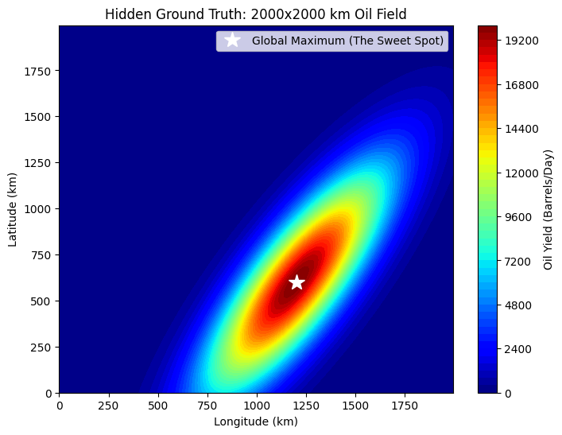

# Bayesian Optimization Exercise - Oil Exploration
Bayesian optimization is an amazing tool for solving problems where getting answers is **expensive, slow, or dangerous**.
During my career as a data scientist, I was first exposed to Bayesian optimization when solving hyperparameter optimization for deep neural networks. It was common
to start with a simple grid search or random search, but that quickly gets out of hand once the model or dataset size 
are large enough. Bayesian optimization tools like scikit-optimize and Optuna help minimize the time spent on hyperparameter
tuning by being "smart" about the process and working like a treasure hunter: using every piece of information from past experiments
to decide exactly where to look next.
 
Bayesian optimization has applications in many fields, including:

* Drug discovery: a drug trial can take months and cost hundreds of thousands of dollars. Bayesian optimization (BO) can help to navigate
the search space and pick the next dosage/concentration/etc. wisely.
* Robotics and autonomous systems: testing physical robots is risky and expensive. Figuring out the best walking gait for a 
bipedal robot using random search might result in the robot falling over and breaking down. Using BO allows engineers to tune controllers
or reinforcement learning policies with only small numbers of physical trials.
* A/B testing and marketing: if you are testing 20 different versions of an ad, you don't want to waste traffic on the low-performing ones for long.
BO allows marketing teams to shift toward the best-performing versions of the website in real-time.

I could go on with use cases but I'll finally talk about the one in this example: oil exploration. If drilling a hole on the ground costs US$10 million, 
you can't just "guess" drilling locations until you hit the jackpot, you'd need a smarter approach. This is why Bayesian optimization is extremely useful.

The process relies on two components:

* **The surrogate model (the "map")**: Since we don't have the ground truth, we need a surrogate model (usually a Gaussian Process) that estimates the relationship between the drilling locations and estimated oil yields. It doesn't just predict the performance, it also predicts the **uncertainty**.

* **The acquisition function (the "decision maker")**: This is the logic used to pick the next drilling location, balancing two competing goals, exploitation (looking in areas where surrogate model predicts high oil yields) and exploration (looking in areas where uncertainty is high, in case a better solution is hiding there).

## Intro 
To start with something simple, we simulate a square grid (2000 km x 2000 km) where a 2D Gaussian distributed reservoir is hidden. The reservoir has a high covariance and has a maximum yield of 20,000 barrels/day, as seen in the plot below:

  

## Mathematical Definition
In oil exploration, the objective function is the volume of oil extracted at a specific coordinate (latitude, longitude). Since drilling a test well can cost millions of dollars, we treat this square grid as a black box and use Bayesian Optimization to pick the next drilling site. 

### 1. The Objective Function
We define a function $f(x)$, where $x$ represents a coordinate. We **don't** know the shape of $f(x)$ — that is, we only get to observe its value by drilling. Say, to start we have a few observation points $$D = \\{(x_1, y_1), \dots, (x_n, y_n)\\}$$, where $y$ is the oil yield in # of barrels/day.

### 2. The Gaussian Process (GP)
As mentioned in the introduction, we assume $f(x)$ follows a Gaussian Process. This is a collection of random variables, any number of which have a joint Gaussian distribution. A GP is defined by a mean 